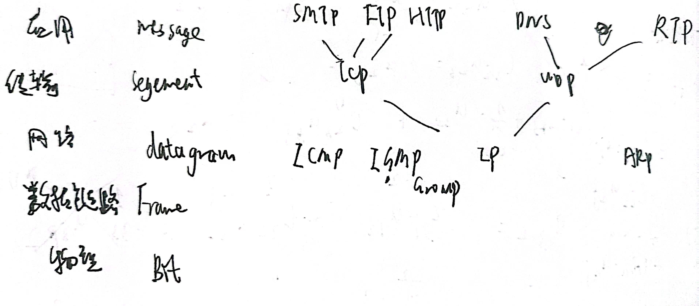
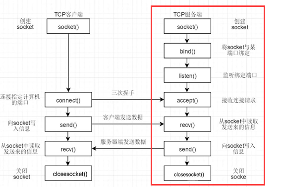
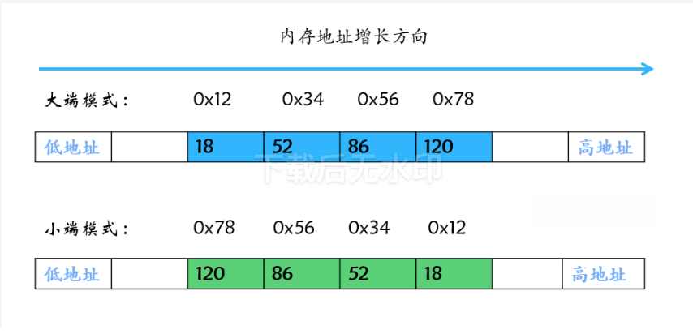

# Socket - C语言
*@Author abcd1234 & AI*  
*@Time 2024.3.19*
## 知识基础
- 网络模型
- 网络协议
- 网络编程

### 网络模型
- ISO/OSI七层模型
- TCP/IP四层模型



### 网络协议
#### TCP
- Transmission Control Protocol（传输控制协议）
- 面向连接的、可靠的、基于字节流的传输层通信协议
- 提供数据完整性、顺序性和可靠性
#### UDP
- User Datagram Protocol（用户数据报协议）
- 无连接的、不可靠的传输层通信协议
- 不保证数据的可靠性和顺序性，适用于实时数据传输

### 网络编程
- 网络编程是指编写程序，使一台计算机上的应用程序能够通过网络与另一台计算机上的应用程序进行通信和数据交换

## 网络套接字 - Socket
### 定义
Socket（套接字）是在网络编程中用于实现网络通信的一种机制，它提供了一种统一的编程接口，使得应用程序可以通过网络进行数据交换。在操作系统中，Socket被视为通信的端点，可以通过网络与其他应用程序建立连接并进行数据传输。
### 位置
Socket位于网络协议栈的传输层，位于TCP和UDP协议之上。它提供了一个抽象的接口，使得应用程序可以方便地通过网络进行通信。
### 内容
1. IP地址：Socket中包含了对方主机的IP地址，用于确定数据传输的目标地址。
2. 端口号：Socket中包含了对方主机的端口号，用于确定数据传输的目标端口。
3. 协议：Socket中包含了所使用的通信协议，如TCP或UDP，用于规定数据传输的方式。
4. 状态信息：Socket会记录当前的连接状态，如已连接、未连接、监听等，以便进行合适的操作。
5. 缓冲区：Socket通常包含发送缓冲区和接收缓冲区，用于临时存储待发送和接收的数据。
6. 选项和参数：Socket可能包含一些可配置的选项和参数，如超时设置、套接字类型等，以影响通信行为。
### 流程


## C语言接口
### 库与头文件
windows下使用Winsock库，Linux下使用Socket库。
```c
/* Windows */
#include <winsock2.h>
#pragma comment(lib,"ws2_32.lib") //Winsock库文件
/* Linux */
#include <sys/socket.h>
#include <arpa/inet.h>
#include <unistd.h>
#include <netinet/in.h>
```
#### 知识补充
- pragma comment(lib,"xxx.lib")：在编译时将指定的库文件链接到可执行文件中。
- windows下的配置方式：
  - 项目属性->链接器->输入->附加依赖项，添加ws2_32.lib
- 如何获取ws2_32.lib：
  - 下载Devcpp，自带MinGw 的gcc，在MinGw的安装目录下，进入mingw32文件夹，找到lib32文件夹，里面就有libws2_32.a

### 函数
#### WSAStartup
- 功能：初始化winsocket库
- 参数：
    - wVersionRequested：指定要使用的winsocket版本
    - lpWSAData：指向WSADATA结构的指针，用于存储winsocket的版本和配置信息
- 返回值：
  - 成功返回0
  - 失败返回SOCKET_ERROR
##### WSADATA
- 结构体，用于存储winsocket的版本和配置信息
```c
typedef struct WSAData {
    WORD        wVersion;       //ws2_32.dll 建议我们使用的版本号
    WORD        wHighVersion;   //ws2_32.dll 支持的最高版本号
#ifdef _WIN64
    unsigned short iMaxSockets; //2.0以后不再使用
    unsigned short iMaxUdpDg;   //2.0以后不再使用
    char        *lpVendorInfo;  //2.0以后不再使用
    char szDescription[WSADESCRIPTION_LEN+1];
    //一个以 null 结尾的字符串，用来说明 ws2_32.dll 的实现以及厂商信息
    char szSystemStatus[WSASYS_STATUS_LEN+1];
    //一个以 null 结尾的字符串，用来说明 ws2_32.dll 的状态以及配置信息
#else
    char szDescription[WSADESCRIPTION_LEN+1];  //32位版本，同上
    char szSystemStatus[WSASYS_STATUS_LEN+1];  //32位版本，同上
    unsigned short iMaxSockets; //32位版本，同上
    unsigned short iMaxUdpDg;   //32位版本，同上
    char        *lpVendorInfo;  //32位版本，同上
#endif
} WSADATA, *LPWSADATA;
```
##### WORD
16位无符号整数
```c
wVersionRequested = MAKEWORD(2,2) // 版本号2.2
```
#### 调用WSAStartup
```c
int main() {
    WSADATA wsaData;
    WSAStartup( MAKEWORD(2, 2), &wsaData); //建议使用2.2版本
    
    //以下为测试信息，打印相应的数值用于测试
    printf("wVersion: %d.%d\n", LOBYTE(wsaData.wVersion), HIBYTE(wsaData.wVersion));
    printf("wHighVersion: %d.%d\n", LOBYTE(wsaData.wHighVersion), HIBYTE(wsaData.wHighVersion));
    printf("szDescription: %s\n", wsaData.szDescription);
    printf("szSystemStatus: %s\n", wsaData.szSystemStatus);

    return 0;
}
```
#### WSACleanup
```c
    WSACleanup();
```
#### socket
- 功能：创建一份socket（未初始化）
- 参数：
  - af: 地址族
  - type: 套接字类型
  - protocol: 协议
- 返回值：
  - 成功：返回套接字描述符（非负值）
  - 失败：返回INVALID_SOCKET

```c
/**传参说明
 * af: 如果是采用ipv4，则AF_INET；如果是ipv6，则AF_INET6
 * type: 套接字类型，SOCK_STREAM表示TCP，SOCK_DGRAM表示UDP
 * protocol: 协议类型，0表示默认协议，一般为0
 */
int sockfd=socket(AF_INET,SOCK_STREAM,0);//建立套接字
```

#### bind
- 功能：将套接字与指定的IP地址和端口绑定
- 参数：
  - sockfd: 套接字描述符
  - addr: 指向sockaddr_in结构体的指针
  - addrlen: sockaddr_in结构体的长度
- 返回值：
  - 成功：返回0
  - 失败：返回SOCKET_ERROR
```c
    SOCKET server_socket;
    struct sockaddr_in server;

    // 创建套接字
    if ((server_socket = socket(AF_INET, SOCK_STREAM, 0)) == INVALID_SOCKET) {
    fprintf(stderr, "socket failed with error: %ld\n", WSAGetLastError());
    WSACleanup();
    exit(EXIT_FAILURE);
}

    server.sin_family = AF_INET;
    server.sin_addr.s_addr = INADDR_ANY;
    server.sin_port = htons(PORT); // htons和htonl：字节序转换函数

    // 绑定地址和端口
    if (bind(server_socket, (struct sockaddr *)&server, sizeof(server)) == SOCKET_ERROR) {
        fprintf(stderr, "bind failed with error: %d\n", WSAGetLastError());
        closesocket(server_socket); // 因为之前新建了，所以要关掉
        WSACleanup();
        exit(EXIT_FAILURE);
    }
```

##### sockaddr_in和sockaddr
sockaddr和sockaddr_in是用于处理网络通信地址的结构体，主要用于指定网络通信中的地址信息。在网络中，地址主要具有以下三个方面的属性：
1. 地址类型：包括IPv4和IPv6等不同类型的网络地址。
2. IP地址：IP地址根据规模和用途可分为A类、B类、C类、D类和E类，分别对应不同范围的网络规模和用途。
3. 端口号：端口号类似于门牌号，用于区分不同应用程序或服务，范围为0到65535，客户端通过IP地址和端口号找到服务器端的特定服务。

sockaddr结构体用于存储参与套接字通信的计算机上的Internet协议（IP）地址，提供了一种统一的地址表示方法，并可以在不同的函数调用中使用。而sockaddr_in结构体则是对sockaddr的扩展，将端口号和目标地址分开存储，以便更方便地操作Internet环境下的套接字地址。

**内容**：
```c
struct sockaddr_in {
    short   sin_family;      //协议族，与前面Socket函数中提到的一样，我们这里使用AF_INET
    u_short sin_port;        //端口号，需要使用网络字节序
    struct in_addr sin_addr; //IP地址，需要使用网络字节序
    char    sin_zero[8];     //没有实际意义,只是为了跟SOCKADDR结构在内存中对齐
};
```

**总结**：
- sockaddr和sockaddr_in结构体长度相同，都占用16个字节的内存空间，可以相互转化。
- sockaddr常用于bind、connect、recv、send等函数的参数，用于指定通用的套接字地址。
- sockaddr_in结构体适用于Internet环境下套接字的地址形式，在网络编程中常对其进行操作来建立所需的信息，并通过强制类型转换与sockaddr进行交互。
- 在网络编程中，首先给sockaddr_in变量赋值，然后通过强制类型转换传入使用sockaddr作为参数的函数来完成相关操作。

##### 字节序
- 大端字节序：数据的高位字节存储在内存的低地址处，低位字节存储在内存的高地址处。
- 小端字节序：数据的高位字节存储在内存的高地址处，低位字节存储在内存的低地址处。

在实际使用过程中，网络序一般是小端字节序，主机序一般是大端字节序。
- 对于原数据0x12345678：


C/C++语言编写的程序里数据存储顺序是跟编译平台所在的CPU相关的，而现在比较普遍的x86处理器是小端模式（Little Endian）。Java编写的程序则唯一采用Big Endian方式来存储数据。

所以，如果你的C/C++程序通过Socket将变量a = 0x12345678的首地址传递给了Java程序，由于Java采取Big Endian方式存取数据，很显然，本地数据没问题，传过去就变成0x78563412，这就出问题了。毕竟不是所有的客户端和服务端都是同一种语言、同一种CPU。因此转换的问题就来了。

#### listen
- 功能：使用套接字，监听其内描述端口的连接请求。此函数会使套接字进入休眠状态，直到有新的连接请求为止。
- 参数：
    - sockfd：需要监听的套接字文件描述符。
    - backlog：最大并发连接数。
- 返回值：
  - 成功返回0
  - 失败返回-1
```c
    // 监听连接
    if (listen(server_socket, 5) == SOCKET_ERROR) {
        fprintf(stderr, "listen failed with error: %d\n", WSAGetLastError());
        closesocket(server_socket);
        WSACleanup();
        exit(EXIT_FAILURE);
    }
```

#### accept
- 功能：接受一个连接请求，并返回一个新的套接字文件描述符，用于与客户端通信。
- 参数：
    - sockfd：需要监听的套接字文件描述符。
    - addr：指向 sockaddr 结构体变量的指针，将会被用于储存客户端地址信息。
    - addrlen：指向整型的指针，值为客户端地址信息长度，可以使用 sizeof 函数计算。
- 返回值：
  - 成功返回新的套接字文件描述符
  - 失败返回-1
```c
    // 接受连接
    client_socket = accept(server_socket, (struct sockaddr *)&client_addr, &sizeof(client_addr));
    if (client_socket == INVALID_SOCKET) {
        fprintf(stderr, "accept failed with error: %d\n", WSAGetLastError());
        closesocket(server_socket);
        WSACleanup();
        exit(EXIT_FAILURE);
    }
```

#### recv
- 功能：从套接字接收数据。
- 参数：
    - sockfd：需要接收的套接字文件描述符。
    - buf：指向接收数据的缓冲区的指针。
    - len：接收数据的长度。
    - flags：接收标志。
- 返回值：
  - 成功返回实际接收到的数据长度
  - 失败返回-1
```c
#define BUFFER_SIZE 1024
    char buffer[BUFFER_SIZE] = {0};
    recv(client_socket, buffer, BUFFER_SIZE, 0);
    printf("Client >> %s\n", buffer);
/**@para flags
 * MSG_DONTROUTE：表示不使用指定路由，对send、sendto有效 
 * MSG_PEEK：对recv, recvfrom有效，表示读出网络数据后不清除已读的数据 
 * MSG_OOB：对发送接收都有效，表示发送或接受加急数据
 */
```

#### send
- 功能：将数据发送到套接字。
- 参数：
    - sockfd：需要发送的套接字文件描述符。
    - buf：指向发送数据的缓冲区的指针。
    - len：发送数据的长度。
    - flags：发送标志。
- 返回值：
  - 成功返回实际发送的数据长度
  - 失败返回-1
```c
    char buffer[BUFFER_SIZE] = {0};
    if (recv(clientSocket, buffer, BIT_NUM, 0) <= 0)
    {
        printf("Receive failed.\n");
        return 1;
    }
```

#### closesocket
- 功能：关闭套接字。
- 参数：
    - sockfd：需要关闭的套接字文件描述符。
- 返回值：
  - 成功返回0
  - 失败返回-1
```c
    closesocket(client_socket);
```

#### connect
- 功能：连接到指定的服务器。
- 参数：
    - sockfd：需要连接的套接字文件描述符。
    - serv_addr：指向服务器地址信息的指针。
    - addrlen：服务器地址信息的长度。
- 返回值：
  - 成功返回0
  - 失败返回-1
```c
    struct sockaddr_in server_addr;
    server_addr.sin_family = AF_INET;
    server_addr.sin_port = htons(SERVER_PORT);
    server_addr.sin_addr.s_addr = inet_addr(SERVER_IP);
    if (connect(client_socket, (struct sockaddr *)&server_addr, sizeof(server_addr)) < 0)
    {
        printf("Connect failed.\n");
        return 1;
    }
```

##### inet_addr
- 功能：将点分十进制IP地址转换为整数表示形式。
- 参数：
    - ip_str：点分十进制IP地址字符串。
- 返回值：
  - 成功返回整数表示形式的IP地址
  - 失败返回-1

## 结语
Socket是技术，是全语言通用的，本文以纯C语言为例，介绍了Socket的基本概念、工作原理、以及使用Socket进行网络通信的基本步骤。但是，在实际使用中，不要拘泥于语言，而是要关注于Socket本身，因为Socket是一种网络通信协议，无论使用何种编程语言，只要遵循Socket规范，就能够实现网络通信。

## 参考资料
- 图片来源：[dotcpp网站](https://www.dotcpp.com/)
- 知识来源：学习后自行整理
- 参考教程：[dotcpp网站](https://www.dotcpp.com/)